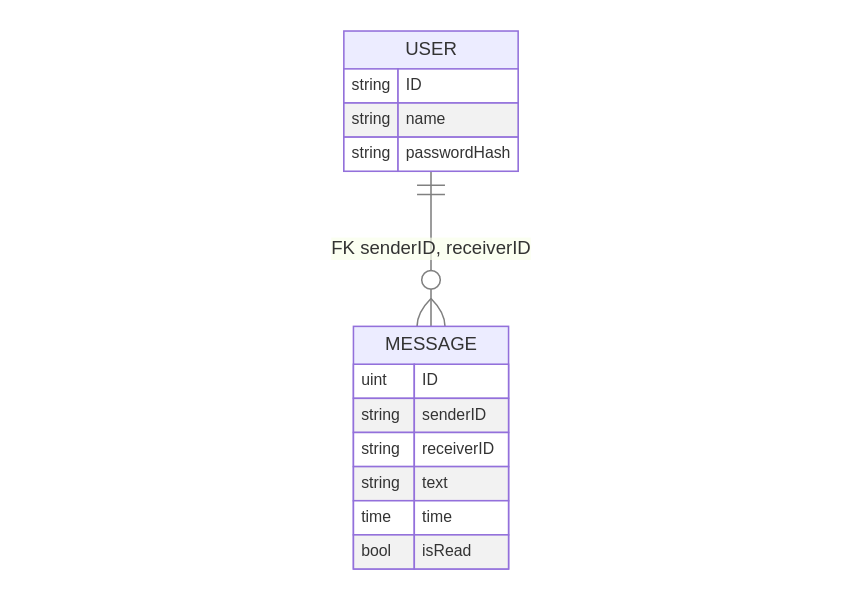

### finally
Мессенджер базового функционала с бэкендом go (gorilla websocket + gorm) и фронтендом на react.
Запускался на яндекс клауде, но уже остановлен.
Пример работы с локальным запуском сервера + фронтенда https://drive.google.com/file/d/1h4xf6BTtQ94XzV-3leK8vEIH1vAATzrZ/view?usp=sharing

### инструкция
При открытии страницы должно появиться модальное окно авторизации. Для регистрации надо ввести все поля, для входа - первые два. 
login - аналог тэга в телеграме, используется как id пользователя.
Чтобы вновь открылось окно авторизации надо перезагрузить страницу.

Когда вы вошли в аккаунт вас перекидывает на диалог с самим собой. Чтобы открыть другой чат в верхнем левом углу надо ввести имя юзера (тэг) и нажать enter. 
Сейчас есть зарегистрированные юзеры "ilya", "misha". Между начатыми диалогами можно переключаться нажатием на чат (как в тг)

Для отправки сообщения вводите текст и нажимаете enter / кнопку send

### мессенджер

У каждого пользователя уникальный никнейм, можно начать личную переписку с любым пользователем зная его никнейм. В левой части страницы список начатых переписок. Переписка выглядит как список сообщений в обратном хронологическом порядке. Можно редактировать и удалять сообщения. При регистрации придумываешь не занятый никнейм и пароль. При открытии страницы мессенджера надо авторизоваться. 

ссылка на фигму

https://www.figma.com/file/DJmkohxRGkdEq3G0lgiziK/Untitled?type=design&node-id=0%3A1&mode=design&t=uD7amv6G1Jx3e2D8-1

upd: пересоздал ветку, чтоб не было мерж конфликтов

### task3

Сделал кажется всю верстку главной страницы.
Можно переключаться между чатами (через useParams).
С "/" (там пустая страница) перенапрвляет на "/chat/ilya", потому авторизацию не делал.

В `data.js` есть список начатых диалогов (и биекция id (тэг) <-> имя) и генерятся какие-то сообщения для них.
Все данные статичные, при отправке сообщения ничего не происходит, никаких useState не делал, 
взаимодействие с локальным сервером тоже, 
потому что верстка заняла очень много времени,
да и занятие по редуксу я пока не посмотрел, а он наверное будет очень полезен.

### task4
видео пример по ссылке https://drive.google.com/file/d/1GlZt-RJNbWuTAB7vidbvW-xPXVwutNWH/view?usp=sharing

Подключил redux, сделал API сервера и сервер-заглушку, вроде все нормально работает, 
а именно можно получать и слать сообщения (по кнопке send и нажатию enter), работает маркировка непрочитанных сообщений 
(какие сообщения в области видимости не учитывается, учитывается только открыта ли переписка), работает поиск людей по никнейму

Код местами страшный, но сделать его красивее займет много времени и умственных усилий, а их и так много ушло, чтобы написать все это.
Схема из библиотеки normalizr по факту не используются, но удобно что они есть, чтобы понимать какая структура объектов 

#### Баги:
Пошаманил со скроллом сообщений, при получении сообщения если мы смотрели на конец переписки, 
то оно само проскроллит еще вниз до присланного сообщения, если мы сами отрпавили сообщение, то тоже проскроллит.
Но из-за плавного скролла, если одновременно тебе приходит сообщение и ты сам присылаешь, может перестать скроллить. 
Если сделать скролл не плавным, то проблема уходит.

Из-за того что вместо сервера заглушка, при переключении переписки есть артефакты 
(есть про это коммент в serverImpl.js getData, waitNewData)

### task5

#### Entity-Relation Diagram

#### Business logic pipeline

### task6
Сделал сервер, авторизация без токенов (при обновлении страницы заново авторизуешься),
посмотрю нужное занятие и сделаю в 7 задании нормально.

Но уже работает со фронтендом.
Видео работы https://drive.google.com/file/d/1h4xf6BTtQ94XzV-3leK8vEIH1vAATzrZ/view?usp=sharing

Сделано с gorilla websocket.

Логика такая - при подключении создаем объект клиента, при логине/регистрации кладем клиента в общую мапу подключенных клиентов.

При подключении клиента создается 3 горутины:
1) Слушает сокет, принимает запросы, обрабатывает их
2) Пишет в сокет, что писать в сокет читает из соответствующих каналов
3) Слушает канал "пинга" - если другой юзер написал нам сообщение, то он напишет в этот канал, мы прочитаем и сформируем ответ

Ответы на запросы есть 4 видов
1) послать всю информацию нужную фронтенду (все сообщения открытого чата, последние сообщения начатых чатов, имена юзеров начатых чатов)
2) послать имя одного юзера (нужно для поиска людей через соответствующее окошко во фронтэнде)
3) если при обработке запроса возникла ошибка - отсылаем ошибку
4) просто строка с информацией - "login success" / "register success"

#### UPD
Посмотрел лекцию по авторизации и есть ощущение, что мне не нужны токены, 
потому что и так поддерживается соединение при помощи вебсокета.
Сейчас при обновлении страницы нужно заново логиниться, можно оставить так, 
или же сохранять где-то на фронтенде данные последней успешной авторизации (логин, пароль), 
чтобы если например интернет отвалился не логиниться заново, а фронт сделал бы это сам, 
но тогда надо будет добавить в дизайн еще кнопку авторизации, а бэкенд никак не поменяется, 
так что неясно, насколько оправданы усилия будут.

По бэкенду: я сейчас при запросах никак не проверяю, например в запросе отправки сообщения,
что корректно указан отправитель сообщения 
(условно пытаются отправить сообщения от чьего-то лица, хотя залогинились за другого пользователя).
Можно добавить проверок на это, и как будто бы на этом этапе все по бэкенду.
